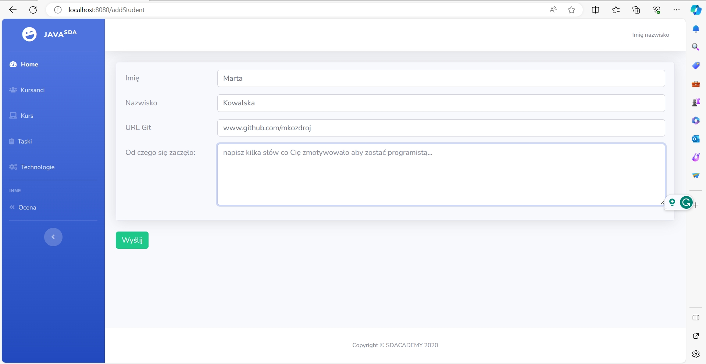

# Spring_StudentApp :mortar_board:

> Simple CRUD application for managing students and their tasks.
> Project developed during the Go for Java Girl bootcamp classes.
> The project was created based on provided JSP views.

## Table of Contents
* [General Information](#general-information)
* [Technologies Used](#technologies-used)
* [Screenshots](#screenshots)

## General information
The application has such functionalities:

- Add student, Edit student, delete student
- Viewing list of students
- Add task, Edit task, Delete task
- Viewing list of tasks

- The default login is: admin
- Default password is: admin

- The project will not be further developed. It was used to learn Spring Framework and JSP.

## Technologies Used
- Java ver. 17
- Spring Boot 2.7.17
- MySQL database
- Bootstrap 4.0.7
- JSP
- Lombok
- Maven

## Screenshots
Home Page

Page with view of students

Page with view of tasks

Page with view of adding student 

Page with view of adding task

